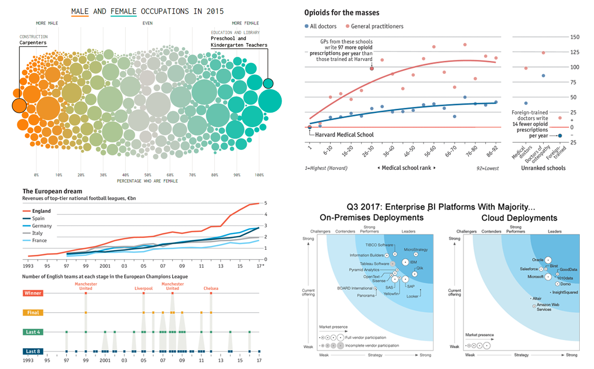
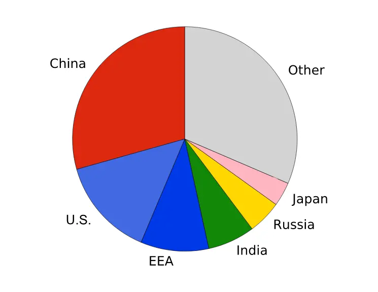

## Danang Hilal Kurniawan
## Kelas RA

# Good Visualization

## Gambar 1 (good visualization)


```python
Image(filename='VDI/pic4.png')
```


    

    


## Penjelasan Visualisasi Data

### 1. Male and Female Occupations in 2015 (Bubble Chart)

- **Judul:** Male and Female Occupations in 2015
- **Deskripsi:** Diagram lingkaran (bubble chart) yang menggambarkan persentase pria dan wanita dalam berbagai profesi pada tahun 2015. Ukuran lingkaran mewakili jumlah orang yang bekerja di profesi tersebut.
- **Sumbu X:** Menunjukkan persentase pekerja perempuan dalam suatu profesi, dari 0% (paling dominan laki-laki) hingga 100% (paling dominan perempuan).
- **Keterangan Penting:**
  - Di sisi kiri, profesi yang didominasi laki-laki seperti tukang kayu (Carpenters).
  - Di sisi kanan, profesi yang didominasi perempuan seperti guru prasekolah dan taman kanak-kanak (Preschool and Kindergarten Teachers).
  - Semakin besar lingkaran, semakin banyak pekerja di profesi tersebut.
  - Warna: Oranye untuk profesi dominan laki-laki, biru kehijauan untuk dominan perempuan.

### 2. Opioids for the Masses (Line Graph)

- **Judul:** Opioids for the Masses
- **Deskripsi:** Grafik ini menunjukkan jumlah resep opioid per tahun yang ditulis oleh dokter umum (General Practitioners) dan semua dokter, dibagi berdasarkan peringkat sekolah kedokteran tempat mereka belajar.
- **Sumbu X:** Peringkat sekolah kedokteran, dengan Harvard Medical School berada di peringkat tertinggi (1), hingga sekolah dengan peringkat lebih rendah.
- **Sumbu Y:** Jumlah resep opioid yang ditulis setiap tahun.
- **Keterangan Penting:**
  - Dokter dari sekolah berperingkat lebih rendah menulis lebih banyak resep opioid dibandingkan dokter lulusan Harvard.
  - Tren menunjukkan dokter umum dari sekolah berperingkat rendah menulis hampir dua kali lebih banyak resep dibandingkan lulusan Harvard.

### 3. The European Dream (European Football Revenue) (Line and Scatter Plot)

- **Judul:** The European Dream: Revenues of Top-Tier National Football Leagues, €bn
- **Deskripsi:** Grafik garis ini menunjukkan pendapatan liga sepak bola utama Eropa (Inggris, Spanyol, Jerman, Italia, dan Prancis) dari tahun 1993 hingga 2017.
- **Sumbu X:** Tahun (1993 hingga 2017).
- **Sumbu Y:** Pendapatan liga (dalam miliar euro).
- **Keterangan Penting:**
  - Liga Inggris memiliki pertumbuhan pendapatan yang signifikan dibandingkan liga lain.
  - Bagian bawah menunjukkan partisipasi klub sepak bola Inggris di Liga Champions, dengan warna dan titik menunjukkan tahapan (pemenang, final, semifinal, dan perempat final) dari tahun ke tahun.

### 4. Q3 2017: Enterprise BI Platforms (Quadrant Chart)

- **Judul:** Q3 2017: Enterprise BI Platforms With Majority On-Premises Deployments vs. Cloud Deployments
- **Deskripsi:** Visualisasi ini membandingkan dua grafik matriks yang menunjukkan posisi berbagai platform Business Intelligence (BI) dalam hal penerapan di tempat (on-premises) dan cloud.
- **Sumbu X dan Y:** 
  - Sumbu X: Kekuatan penawaran saat ini (current offering).
  - Sumbu Y: Kekuatan pasar (market presence).
- **Keterangan Penting:**
  - Di sebelah kiri adalah platform BI yang dominan dalam penerapan di tempat, seperti TIBCO Software dan IBM.
  - Di sebelah kanan adalah platform yang dominan dalam penerapan berbasis cloud, seperti Oracle dan Salesforce.
  - Setiap platform ditempatkan berdasarkan kekuatan penawaran dan kekuatan pasar, dengan penanda (dot) yang mewakili posisi masing-masing platform.

### Mengapa Ini Contoh Good Visualization:
- **Clarity (Kejelasan):** Setiap visualisasi jelas dalam menyampaikan informasi. Sumbu dan keterangan mendukung pemahaman data dengan cepat.
- **Relevansi:** Informasi yang disajikan langsung berkaitan dengan topik yang diangkat, tanpa penambahan detail yang membingungkan.
- **Data Representation:** Jenis grafik dipilih dengan tepat untuk menyampaikan pola dan tren, seperti bubble chart untuk distribusi gender, line chart untuk tren pendapatan, dan quadrant chart untuk posisi pasar.
- **Kombinasi Visual yang Efisien:** Gambar ini menggunakan berbagai jenis visualisasi (bubble chart, line chart, scatter plot, dan quadrant chart) untuk menyajikan beragam informasi, yang memudahkan perbandingan antar kategori data.


## Gambar 2 (good visualization)


```python
Image(filename='VDI/pic1.png')
```


    

    


## Penjelasan Visualisasi Peta Harga Rumah Rata-Rata (2022)

### Deskripsi Visualisasi

- **Judul:** Average Home Value (Nilai Rumah Rata-Rata Tahun 2022)
- **Deskripsi Umum:**
  - Peta ini menampilkan distribusi harga rumah rata-rata di wilayah Los Angeles, Amerika Serikat pada tahun 2022.
  - Setiap lingkaran oranye mewakili area tertentu dan ukurannya menunjukkan rata-rata harga rumah di lokasi tersebut.
  
- **Keterangan Utama:**
  - **Legenda Ukuran Lingkaran:**
    - Lingkaran-lingkaran dibagi berdasarkan rentang harga dalam satuan ribu dolar AS, seperti:
      - 8500 - 30,000
      - 3400 - 8500
      - 1338 - 3400
      - 447 - 1338
      - 85 - 447
      - Other (untuk data di luar rentang tersebut).
    - Semakin besar lingkaran, semakin tinggi rata-rata harga rumah di area tersebut.
    
  - **Lokasi yang Ditampilkan:**
    - Peta menyoroti berbagai kawasan di sekitar Los Angeles, seperti Malibu, Beverly Hills, Glendale, Pasadena, dan lainnya.
    - Terdapat juga perbandingan antar area dengan peta yang sangat jelas menunjukkan konsentrasi harga rumah yang tinggi di daerah-daerah mewah seperti Beverly Hills dan Malibu, di mana lingkarannya lebih besar.
    
  - **Informasi Tambahan:**
    - Di sisi kanan atas terdapat keterangan yang menunjukkan bahwa nilai rumah rata-rata untuk tampilan peta saat ini adalah **933,688 dolar** (tahun 2022).
    - Pengguna juga bisa mengakses berbagai lapisan (layers) atau koordinat melalui panel di kiri atas untuk menampilkan informasi tambahan.

### Mengapa Visualisasi Ini Adalah **Good Visualization**:

1. **Clarity and Focus (Kejelasan dan Fokus)**:
   - Visualisasi ini memanfaatkan **peta tematik** yang menekankan fokus pada distribusi harga rumah. Ukuran lingkaran yang proporsional sangat membantu dalam membedakan area dengan harga rumah rendah, sedang, hingga tinggi.
   
2. **Easy Interpretation (Mudah Dipahami)**:
   - Penggunaan warna yang seragam (oranye) dan perubahan ukuran lingkaran sebagai indikator harga rumah memberikan pemahaman yang cepat dan intuitif bagi pengguna. Tidak ada elemen yang berlebihan yang dapat membingungkan pengguna.

3. **Geographical Context (Konteks Geografis)**:
   - Peta ini memberikan informasi yang sangat relevan dalam konteks geografis, di mana pengguna bisa langsung melihat perbedaan nilai properti berdasarkan wilayah dengan sangat jelas, misalnya area mewah seperti **Beverly Hills** dan **Malibu** dibandingkan dengan area yang memiliki harga rumah lebih rendah.

4. **Effective Use of Space (Penggunaan Ruang yang Efektif)**:
   - Peta menggunakan tata letak yang sangat efektif, di mana informasi kunci seperti legenda harga dan rata-rata harga rumah ditempatkan di tempat yang mudah dilihat, tetapi tidak mengganggu visualisasi utama.

5. **Interactivity and Usability (Interaktivitas dan Kemudahan Penggunaan)**:
   - Adanya opsi untuk menambahkan lapisan (layers) dan melihat koordinat memberikan fleksibilitas lebih lanjut bagi pengguna untuk menjelajahi data. Hal ini meningkatkan pengalaman visualisasi dengan elemen interaktif yang menambah nilai tanpa mengganggu informasi utama.

6. **Data Granularity (Granularitas Data)**:
   - Visualisasi ini menyediakan granularitas data yang tinggi, memungkinkan pengguna untuk melihat perbedaan harga rumah dengan sangat detail di berbagai kawasan. Peta ini tidak hanya menunjukkan data pada tingkat kota, tetapi juga di tingkat lingkungan yang lebih kecil.

### Kesimpulan:
Visualisasi ini dapat dianggap sebagai contoh **good visualization** karena menyajikan informasi yang kaya dan kompleks (harga rumah) dengan cara yang sangat jelas, terfokus, dan mudah diinterpretasikan. Penggunaan lingkaran proporsional sangat efektif untuk membandingkan harga antar kawasan dan memberi pengguna wawasan geografis yang relevan.


# Bad Visualization

## Gambar 3 (bad visualization)


```python
Image(filename='VDI/pic2.jpeg')
```


    

    


## Penjelasan Visualisasi "How Baby Boomers Describe Themselves"

### Deskripsi Visualisasi

- **Judul:** How Baby Boomers Describe Themselves
- **Deskripsi Umum:**
  - Visualisasi ini menggambarkan cara generasi Baby Boomers mendeskripsikan diri mereka berdasarkan beberapa atribut, seperti: 
    - Leaders (40%)
    - Willing to Learn (61%)
    - Tech-Savvy (22%)
    - People-Savvy (78%)
    - Creative (42%)
  - Setiap atribut diwakili oleh bagian tubuh dari figur manusia abstrak yang terbagi dalam warna yang berbeda.

- **Keterangan Utama:**
  - **Leaders (Pemimpin):** 40% dari Baby Boomers mendeskripsikan diri mereka sebagai pemimpin, yang diwakili oleh kepala figur.
  - **Willing to Learn (Mau Belajar):** 61% dari Baby Boomers mendeskripsikan diri mereka sebagai orang yang mau belajar, yang diwakili oleh lengan figur.
  - **Tech-Savvy (Melek Teknologi):** 22% mendeskripsikan diri mereka sebagai orang yang paham teknologi, diwakili oleh bagian badan.
  - **People-Savvy (Paham Sosial):** 78% menganggap diri mereka paham sosial, diwakili oleh kaki bagian kanan.
  - **Creative (Kreatif):** 42% mendeskripsikan diri mereka sebagai orang yang kreatif, diwakili oleh kaki bagian kiri.

### Mengapa Visualisasi Ini Adalah **Bad Visualization**:

1. **Lack of Data Clarity (Kurangnya Kejelasan Data)**:
   - Setiap atribut yang diwakili oleh bagian tubuh berbeda tidak memberikan kaitan logis atau visual yang jelas. Tidak ada hubungan yang masuk akal antara bagian tubuh figur dengan atribut yang diwakili (misalnya, tidak ada alasan mengapa "kreatif" diwakili oleh kaki).
   - Ukuran bagian tubuh tidak proporsional dengan nilai persentase. Misalnya, 78% untuk "People-Savvy" memiliki bagian kaki yang sama besar dengan "Creative" yang hanya 42%, padahal logikanya, bagian yang lebih besar harus mencerminkan persentase yang lebih besar.

2. **Poor Use of Colors (Penggunaan Warna yang Buruk)**:
   - Warna pada bagian tubuh tidak memiliki keterkaitan atau gradasi yang menunjukkan persentase atau nilai. Ini membingungkan karena tidak ada asosiasi yang jelas antara warna dan data.
   - Selain itu, tidak ada pola warna yang membantu interpretasi. Misalnya, "People-Savvy" dengan persentase tertinggi (78%) menggunakan warna ungu pada kaki, sedangkan "Tech-Savvy" yang lebih rendah (22%) memiliki warna hijau pada badan. Penggunaan warna ini terasa acak dan tidak mendukung pemahaman visual yang baik.

3. **Misleading Representation (Representasi yang Menyesatkan)**:
   - Secara visual, bagian tubuh tidak memberikan indikasi yang akurat tentang perbandingan antar persentase. Sebagai contoh, 61% untuk "Willing to Learn" terlihat seolah-olah memiliki ukuran yang sama dengan 40% untuk "Leaders," meskipun secara numerik terdapat perbedaan yang signifikan.
   - Penggunaan figur manusia dengan atribut yang tersebar di seluruh tubuh membuat fokus data menjadi kabur dan sulit untuk melihat perbandingan secara langsung antar atribut.

4. **Unnecessary Complexity (Kerumitan yang Tidak Diperlukan)**:
   - Visualisasi ini mencoba menyampaikan informasi sederhana dengan cara yang terlalu kompleks dan tidak efektif. Pemecahan atribut berdasarkan bagian tubuh membuat pesan utama sulit diikuti dan menambahkan elemen visual yang tidak diperlukan.
   - Sebuah diagram batang sederhana akan jauh lebih efektif dalam menampilkan perbandingan antar persentase tanpa memerlukan interpretasi tambahan yang membingungkan.

5. **Text Placement and Readability (Penempatan Teks dan Keterbacaan)**:
   - Teks yang menjelaskan setiap atribut ditempatkan pada posisi yang tidak teratur, sehingga membuat visualisasi ini lebih sulit untuk dibaca. Penempatan teks tidak membantu pengguna untuk secara langsung menghubungkan persentase dengan bagian tubuh figur.
   - Kalimat tambahan seperti "I have a smart phone, don’t discount my technical abilities" terlihat tidak relevan dan mengganggu pesan utama yang ingin disampaikan.

### Kesimpulan:
Visualisasi ini dapat dianggap sebagai contoh **bad visualization** karena tidak berhasil menyajikan informasi secara efektif. Penggunaan figur manusia dengan bagian tubuh yang terpisah untuk setiap atribut tidak mendukung data yang ingin disampaikan. Selain itu, pengaturan warna, representasi proporsional yang salah, dan kompleksitas yang tidak diperlukan justru membuat informasi menjadi kabur dan sulit dipahami oleh pengguna.


## Gambar 3 (bad visualization)


```python
Image(filename='VDI/pic3.png')
```


    

    


## Penjelasan Visualisasi "How Baby Boomers Describe Themselves"

### Deskripsi Visualisasi

- **Judul:** How Baby Boomers Describe Themselves
- **Deskripsi Umum:**
  - Visualisasi ini menggambarkan cara generasi Baby Boomers mendeskripsikan diri mereka berdasarkan beberapa atribut, seperti: 
    - Leaders (40%)
    - Willing to Learn (61%)
    - Tech-Savvy (22%)
    - People-Savvy (78%)
    - Creative (42%)
  - Setiap atribut diwakili oleh bagian tubuh dari figur manusia abstrak yang terbagi dalam warna yang berbeda.

- **Keterangan Utama:**
  - **Leaders (Pemimpin):** 40% dari Baby Boomers mendeskripsikan diri mereka sebagai pemimpin, yang diwakili oleh kepala figur.
  - **Willing to Learn (Mau Belajar):** 61% dari Baby Boomers mendeskripsikan diri mereka sebagai orang yang mau belajar, yang diwakili oleh lengan figur.
  - **Tech-Savvy (Melek Teknologi):** 22% mendeskripsikan diri mereka sebagai orang yang paham teknologi, diwakili oleh bagian badan.
  - **People-Savvy (Paham Sosial):** 78% menganggap diri mereka paham sosial, diwakili oleh kaki bagian kanan.
  - **Creative (Kreatif):** 42% mendeskripsikan diri mereka sebagai orang yang kreatif, diwakili oleh kaki bagian kiri.

### Mengapa Visualisasi Ini Adalah **Bad Visualization**:

1. **Lack of Data Clarity (Kurangnya Kejelasan Data)**:
   - Setiap atribut yang diwakili oleh bagian tubuh berbeda tidak memberikan kaitan logis atau visual yang jelas. Tidak ada hubungan yang masuk akal antara bagian tubuh figur dengan atribut yang diwakili (misalnya, tidak ada alasan mengapa "kreatif" diwakili oleh kaki).
   - Ukuran bagian tubuh tidak proporsional dengan nilai persentase. Misalnya, 78% untuk "People-Savvy" memiliki bagian kaki yang sama besar dengan "Creative" yang hanya 42%, padahal logikanya, bagian yang lebih besar harus mencerminkan persentase yang lebih besar.

2. **Poor Use of Colors (Penggunaan Warna yang Buruk)**:
   - Warna pada bagian tubuh tidak memiliki keterkaitan atau gradasi yang menunjukkan persentase atau nilai. Ini membingungkan karena tidak ada asosiasi yang jelas antara warna dan data.
   - Selain itu, tidak ada pola warna yang membantu interpretasi. Misalnya, "People-Savvy" dengan persentase tertinggi (78%) menggunakan warna ungu pada kaki, sedangkan "Tech-Savvy" yang lebih rendah (22%) memiliki warna hijau pada badan. Penggunaan warna ini terasa acak dan tidak mendukung pemahaman visual yang baik.

3. **Misleading Representation (Representasi yang Menyesatkan)**:
   - Secara visual, bagian tubuh tidak memberikan indikasi yang akurat tentang perbandingan antar persentase. Sebagai contoh, 61% untuk "Willing to Learn" terlihat seolah-olah memiliki ukuran yang sama dengan 40% untuk "Leaders," meskipun secara numerik terdapat perbedaan yang signifikan.
   - Penggunaan figur manusia dengan atribut yang tersebar di seluruh tubuh membuat fokus data menjadi kabur dan sulit untuk melihat perbandingan secara langsung antar atribut.

4. **Unnecessary Complexity (Kerumitan yang Tidak Diperlukan)**:
   - Visualisasi ini mencoba menyampaikan informasi sederhana dengan cara yang terlalu kompleks dan tidak efektif. Pemecahan atribut berdasarkan bagian tubuh membuat pesan utama sulit diikuti dan menambahkan elemen visual yang tidak diperlukan.
   - Sebuah diagram batang sederhana akan jauh lebih efektif dalam menampilkan perbandingan antar persentase tanpa memerlukan interpretasi tambahan yang membingungkan.

5. **Text Placement and Readability (Penempatan Teks dan Keterbacaan)**:
   - Teks yang menjelaskan setiap atribut ditempatkan pada posisi yang tidak teratur, sehingga membuat visualisasi ini lebih sulit untuk dibaca. Penempatan teks tidak membantu pengguna untuk secara langsung menghubungkan persentase dengan bagian tubuh figur.
   - Kalimat tambahan seperti "I have a smart phone, don’t discount my technical abilities" terlihat tidak relevan dan mengganggu pesan utama yang ingin disampaikan.

### Kesimpulan:
Visualisasi ini dapat dianggap sebagai contoh **bad visualization** karena tidak berhasil menyajikan informasi secara efektif. Penggunaan figur manusia dengan bagian tubuh yang terpisah untuk setiap atribut tidak mendukung data yang ingin disampaikan. Selain itu, pengaturan warna, representasi proporsional yang salah, dan kompleksitas yang tidak diperlukan justru membuat informasi menjadi kabur dan sulit dipahami oleh pengguna.
